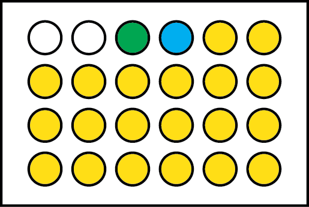
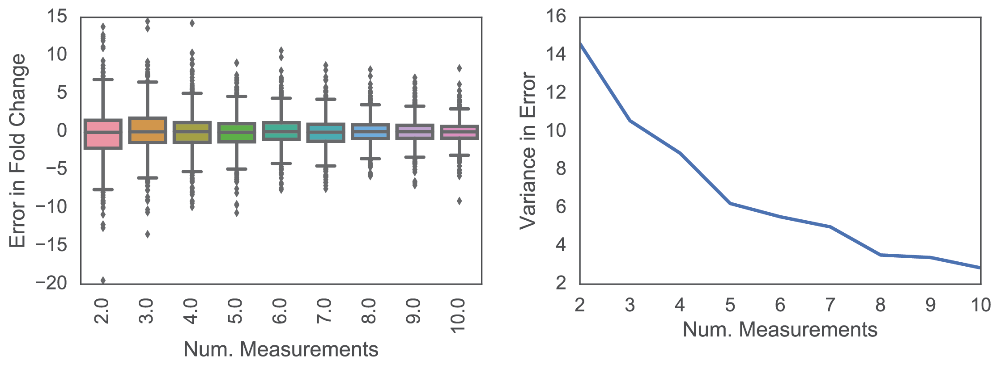

# Abstract

Duplicate or triplicate experimental replicates are commonplace in the high throughput literature. However, it has not been tested whether this is statistically defensible or not. To address this issue, we outline a generic Bayesian framework for analyzing high throughput measurement data, provide posterior densities for statistical parameters used in the evaluation of the data, and use statistical simulations to show that a small increase in replicate experiments can greatly improve accuracy in measurement.

# Introduction

High throughput (HT) screening experiments are necessary for systematically interrogating biology. Statistical tools have been developed for HT data analysis, for example, the Z- and Z'-factors [@Zhang:1999fr; @Edwards:2015ig; @Lee:2010if; @Sui:2007dc] for assay evaluation and identifying true hits, per-plate Z-score normalization [@Malo:2006kg], ANOVA [@Su:2010gb] and the "three standard deviation" (3-SD) rule-of-thumb [@Zhang:1999fr]. These statistical tools would be useful, if not for the widespread use of small numbers of replicate experiments [@Edwards:2015ig; @Wang:2015ba; @Su:2010gb] risking the measurement and assessment of unnecessarily large numbers of false positives and negatives.

Crucially missing from the HT literature are general and extensible Bayesian analysis methods for HT assays. Bayesian methods offer several advantages over the traditional Null Hypothesis Significance Testing (NHST) [@Kruschke:2013jy], including the ability to incorporate prior knowledge where appropriate, model and quantify uncertainty in estimated values. As Bayesian analysis returns a full probabilistic description of the data, multiple hypothesis testing is not an issue as any further comparisons are merely extended summaries of the probabilistic output.

To address the problem of a lack of Bayesian analysis methods, we use a probabilistic programming approach to develop a simple Bayesian hierarchical model of a 'generic' HT assay. In this generic assay, the activity of a sample is being determined relative to a blank well and a positive control. Using this simple Bayesian hierarchical model, we are able to simultaneously provide Bayesian posterior distributions of Z-factors for each sample the assay and for the assay in general, dynamic range of the assay, and fold change activity for each sample. We then address is where and when the common experimental practice of duplicate (`n=2`) or triplicate (`n=3`) are sufficient for detecting true hits.

<!-- potential references:

1. Enhancing reproducibility in cancer drug screening: how do we move forward? http://www.ncbi.nlm.nih.gov/pubmed/25015668
1. Linear models and empirical bayes methods for assessing differential expression in microarray experiments. http://www.ncbi.nlm.nih.gov/pubmed/16646809
1. Empirical Bayesian analysis of paired high-throughput sequencing data with a beta-binomial distribution. http://www.ncbi.nlm.nih.gov/pmc/articles/PMC3658937/
1. Bayesian Analysis of High-Throughput Quantitative Measurement of Protein-DNA Interactions http://journals.plos.org/plosone/article?id=10.1371%2Fjournal.pone.0026105 -->

# Analysis Framework

<!-- key points:
- experimental setup: a generic "fold change" experiment. To make things concrete, do systematic measurement of protein phenotypes (akin to Stanford HIV DB data.)
    - batch effects are controlled for by having internal controls and standards
    - randomization in position is ideal, but may be difficult to achieve in practice.
    - single replicates per plate, use replicate plate measurements.
    - need figure
- simple Bayesian hierarchical model (BGM) of final readout
- what needs to be modelled, and what can be ignored? By setting things up such that plates are internally consistent, only need to do single replicates per plate, but do replicate plates on different experimental runs.
- error modelled as 95% HPD in posterior distribution -->

## Experimental Setup

If carefully considered, the problem of high throughput measurement at it essence is the measurement and estimation of a sample's real-valued property, relative to a standardized control. These are measured relative to a "blank" that should reliably exhibit an instrument signal below its lower limit of detection.

As a concrete example, consider the problem of systematically characterizing a protein mutant family. A standard design for this experiment might involve the following (Figure @fig:assay-scheme):

1. A blank well to define lower instrument detection limit
1. A negative control which forms a biological baseline measurement (e.g. reporter plasmid transfected without protein of interest), which may or may not return the same value as the blank.
1. A positive control that reliably returns a positive signal.
1. The suite of samples that require testing.

{#fig:assay-scheme}

In this setup, the blanks and controls are measured on every single plate, providing a "ladder" against which the data can be compared; with many fold more replicate measurements than individual samples, an experimenter will have a more accurate estimate of their true means and variances. As the commonplace "relative luminescence units" do not allow for easy inter-comparison between experiments, we consider the following normalization procedure in order to achieve this.

Firstly, the limit of detection is not assigned a zero-value, but assigned the relative value of "1" instead. Data that can be used to model uncertainty of the blank is done by taking ensuring that there are two blank wells on the plate. One of the wells is considered "true blank", and the other is treated as a measurement for quantification of the technical uncertainty in the blank well; it does not matter which is used.

Secondly, the samples `{i = 1, 2, 3, ... n, pc, nc, b}` and controls have their raw readings `r` normalized to the "true blank" `tb`. This allows every reading to be normalized to (i.e. divided by) the lower limit of detection, with the smallest value being 1. The fold relative to blank `µ` is given by Equation @eq:fold_blank, where `i` encompasses all samples, the controls, and the replicate blank. This normalized value is used for modelling the error in the fold changes. On each plate, each well gets at least a single replicate measurement; if there is space for duplicates, each replicate is considered an independent measurement of the activity relative to blank, rather than a value to be averaged.

$$ \mu_i = \frac{r_i}{r_{tb}} $$ {#eq:fold_blank}

Thirdly, with replicate plate measurements, there will be variation in the fold change relative to blank. Each computed fold change on the replicate plate is likewise considered an independent fold change measurement.

Using this experimental setup ensures that batch effects are accounted for in the measurement. Provided that there is little variation in the measurement of the blanks, every other sample's readings can be reliably normalized with uncertainty proportional to its true variation. The readings allow one to model the signal strength relative to noise.

## Bayesian Hierarchical Model

With this data on hand, we now consider the Bayesian hierarchical model. While it is possible to use informative prior information on the data, we consider here the "worst case" scenario in which little to nothing is confidently known about the distribution of fold changes and errors for individual samples, except that they may be drawn from a common distribution that is likewise not well defined. Hence, priors are specified as uninformatively as possible.

We assume that the fold changes relative to blank are drawn from a uniform distribution from 10^-10^ to value `u` (+@eq:fold), essentially behaving as a flat positive-valued prior. The lower limit is set to some infinitesimally small value, allowing for uncertainty in the blank measurement. In order to use the data to estimate the upper limit of detection, we place a positive real-valued Exponential prior on it +@eq:upper.

$$ u \sim Exponential(\lambda=0.05) $$ {#eq:upper}

$$ \mu_{i} \sim Uniform(lower=l, upper=u) $$ {#eq:fold}

This places a positive real-valued prior on the master fold change distribution.

The errors `sigma` in fold change measurements are assumed to be heteroskedastic, and drawn from a HalfCauchy distribution as recommended in [@Gelman:2006di], expressing our prior belief that the variance should be low but could also take high values.

$$ \sigma_{i} \sim HalfCauchy(\tau=5) $$ {#eq:sigma}

The data likelihood `L` is modelled as a Normal distribution:

$$ L \sim Normal(\mu=\mu_{i}, \sigma=\sigma_{i}) $$ {#eq:likelihood}

This model is expressed as a probabilistic graphical model (PGM) in Figure @fig:pgm.

{#fig:pgm}

Having modelled these variables, we can now deterministically compute fold changes and their full distributional uncertainty, given the data. Assuming the positive control were of interest as a "reference" standard, then the fold change `f` of each sample `s` relative to the positive control `pc` could be computed as:

$$ f_{s} = \frac{\mu_{s}}{\mu_{pc}} $$

Z- and Z'-factors are used for assay evaluation and sample hit identification, relative to a baseline. Statistically, it is a measure of separation between two distributions, with possible values ranging from negative infinity to 1, with values closer to 1 indicating better separation, and hence better ability to resolve the two samples. With the posterior distribution of estimated fold changes and their variance, the Z- and Z'-factors and their distributional uncertainty may be computed using the formula below [@Zhang:1999fr]:

$$ Z = 1 - \frac{3\sigma_{s} + 3\sigma_{b}}{|\mu_{s} - \mu_{b}|} $$

## Code & Data

All code for simulation and analysis are available as Python scripts and Jupyter notebooks. The archived version used in this publication is released on Zenodo (#TODO), while the source code (including for the manuscript) can be found on [GitHub](^github).

[^github]: https://github.com/ericmjl/bayesian-measurement-paper

# Results

## Modelled error in estimate as function of number of replicates

We first considered how the number of replicate measurements per sample affected our ability to accurately measure the true fold change value. We simulated 5000 unique genotypes, each with a different `mu` and `sigma` drawn from their respective distributions, with a range of 2 to 10 replicate measurements. As shown in Figure @fig:errors, the error in the estimated fold changes is centred around zero regardless of the number of replicate measurements, but the variation in this error decreases with increasing replicate measurements.

{#fig:errors}

## Accuracy as a function of number of replicates

In order to investigate how the number of replicates affected the accuracy, we simulated experimental runs of 100 samples with varying numbers replicate measurements (`n=2` to `n=20`). For each `n`, 20 experimental runs were simulated.

As shown in Figure @fig:accuracy, the baseline accuracy rate with duplicate (`n=2`) measurements, as measured by fraction of actual values inside the posterior density's 95% HPD, falls around the 70-75% range. This means that about 25% of the final posterior 95% HPDs do not encompass the actual value. By contrast, by using `n=5` replicates, the accurate HPD fraction falls around the 85-90% range. Roughly doubling the number of samples decreases the inaccurate fraction by up to 3-fold. Following the law of diminishing marginal returns, additional accuracy can be gained, but at a cost of increasing sample sizes.

{#fig:accuracy}

## Posterior Z- and Z'-factor distributions

Z-factors are often used in HT assays to determine, given the data, whether a particular sample is a "hit" or not, where a "hit" is commonly defined as being above the "baseline", or "threshold". With the posterior distributions, we can now compute the full distribution of Z-factor values for each sample, as shown by our simulation data (Figure @fig:z-factor). As such, the original 3-class system can be extended to 5 classes (Figure @fig:z-factor).

![Z-score classes and simulation data. Circle/dot: HPD mean. Thick lines: HPD inter-quartile range. Thin lines: 95% HPD range. (a) Five Z-score classes based on the Z-score posterior density. (b) Data from one simulation run. Samples 11 and 12 are the blank and the non-extreme positive control in this simulated experiment. (top-left) Posterior density in fold change relative to blank. (top-right) Posterior density of variance. (bottom-left) Deterministic posterior density of fold change relative to positive control. (bottom-right) Deterministic posterior density of Z-factor computed using the non-extreme positive control as the baseline.](./figures/z-factor.png){#fig:z-factor}

The actionable consequences of these Z-value distributions depends on the experimental context. There may be scenarios where downstream experimentation is expensive, and only "true hits" should be tested; in this case, the "probable large separation" samples may be chosen for exclusion, helping to reduce costs. On the other hand, if downstream experimentation is cheap, and it is desirable to have a large set of samples to be processed further, then samples in the "probable small separation" may be included in downstream testing, helping to reduce false negatives. The truism remains: statistics does not replace human judgment of the value of a sample, but can serve as a valuable tool in the decision-making process.

## Bayesian credible intervals are interpretable, robust to outliers, and better account for data range.

Bayesian 95% highest posterior density intervals (HPDIs) are able to better model and capture the range of credible values, given the data. 95% confidence intervals (CIs), in contrast are calculated according to the formula:

$$ CI = Z_{0.95}\frac{\hat{\sigma}}{\sqrt{n}} $$ {#eq:ci}

A common practice in the life sciences is to report mean ± standard error of the mean (SEM). Part of this is borne out of the convenience in computing these values using statistical software, and part of may be motivated by the desire to display error bars that show minimal overlap with controls. As shown in Figure @fig:range-estimates, the SEM grossly under-represents the variation in the data. On the other hand, Bayesian and frequentist 95% confidence intervals much more readily capture the data variation. 

{#fig:range-estimates}

## Simulated outlier plates with systematic error on the entire plate.

## Simulated outlier wells with random dropout.

## Small-scale real-world measurement data.

key points:

- put analysis of polymerase assay data here; can even just be Vivian's replication data and that would be sufficient.

# Discussion

We have outlined a generic Bayesian framework for analyzing high throughput data, allowing for inter-comparability between instruments in the measurements. By "generic", we refer to the common statistical activity in biological measurement, where a sample's value is compared to another "control" sample, rather than absolute quantitation in some physical units.

The core of the framework lies in obtaining measurements that reflect the "fold difference relative to blank". This is predicated on having "blank" values that are necessarily positive. In the event that negative values are obtained, the data can be linearly pre-shifted such that the most negative blank now takes the value of "1". The cloned blank can then be used in the estimation of the uncertainty around the blank.

The framework is extensible to scenarios that we did not consider here. For example, some research groups may opt to do technical replicates per experimental run, take the average of the technical replicates for a sample, and repeat the procedure over replicate experimental runs.

Using the analysis framework with fairly uninformative priors (with the exception of measurement variation, `sigma`), we use simulation studies to show that the commonplace practice of duplicate or triplicate experimental runs with single replicates per run may result in low estimation accuracy. By simply increasing the number of experimental runs to `n=4` or `n=5`, large gains in measurement accuracy may be realized. We recommend that high throughput experimentation consider larger replicate experimental runs.

One advantage in taking a Bayesian view of the data is that multiple hypothesis corrections do not become an issue, and as such no "conservative" or "liberal" corrections (e.g. Bonferroni) need to be applied that may further increase the risk of false negatives or positives. The posterior densities fully summarize our best belief about the parameters (e.g. fold changes & Z-factors), and so any further comparisons are summaries of the summary. That is not to say that false positives and negatives can be avoided; as measurements are considered to be "random samples" from the true distribution, it is still probable to have biased measurements, and hence posterior densities, purely by random chance. Other advantages of the Bayesian approach have been espoused before [@Lin:1999cd; @Kruschke:2013jy], and we do not treat them further here.

## "Precision is the goal"

key points:

- `n=3` + NHST has led to the proliferation of false positive results in the literature.
- `n=some_value` + bayesian can let us identify measurements that have a high degree of uncertainty/variation.
- decision rule is possible: check that 95% HPDs are non-overlapping. alternatively, have a pre-defined ROPE (Kruschke). emphasize: no free lunch.
- deciding whether something is significant should still be on the basis of "biological" significance, not "statistical" significance.

## Software

- to aid in spreading of this idea, we have released the software under an MIT license
- also provided a GUI interface for specifying priors and conducting analysis, with sensible uninformative defaults.

# References
